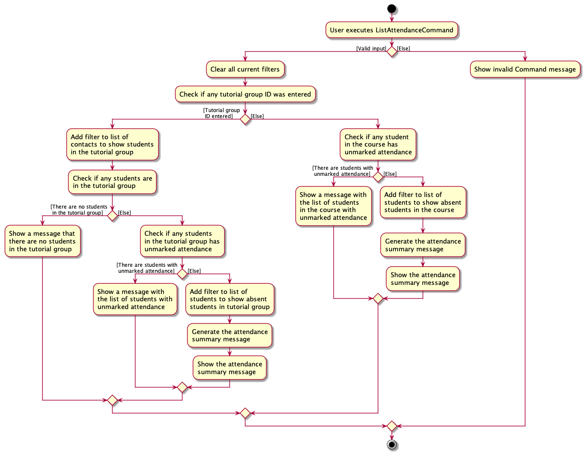
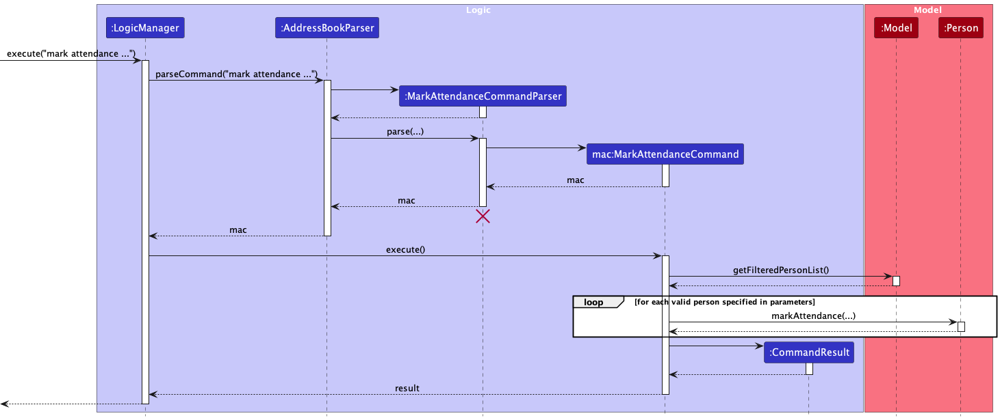
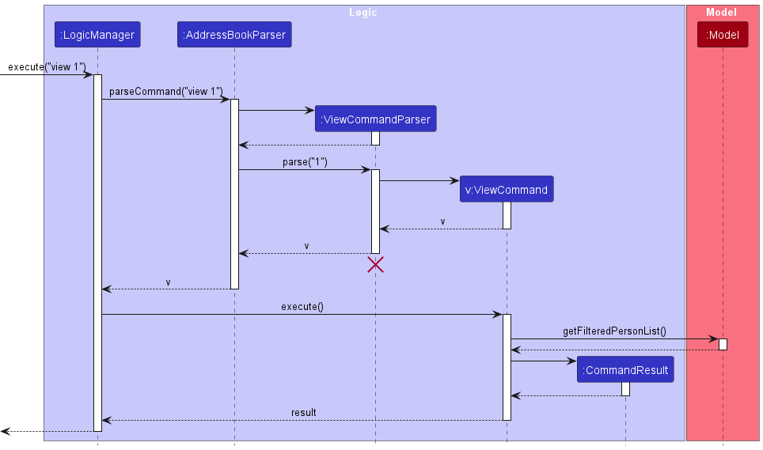
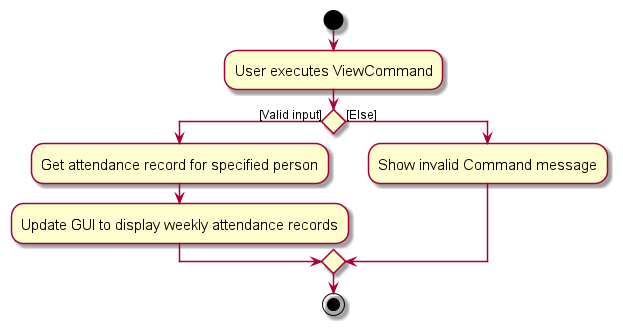
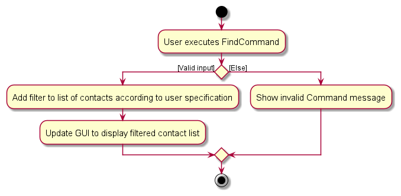
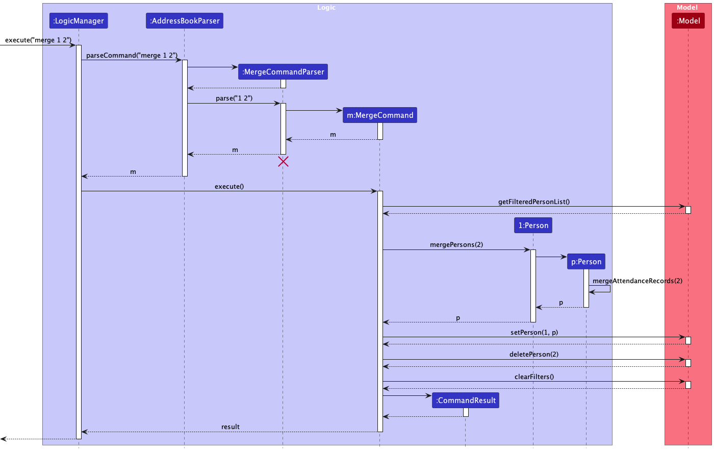
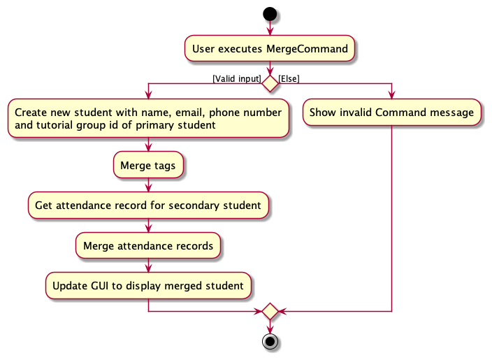
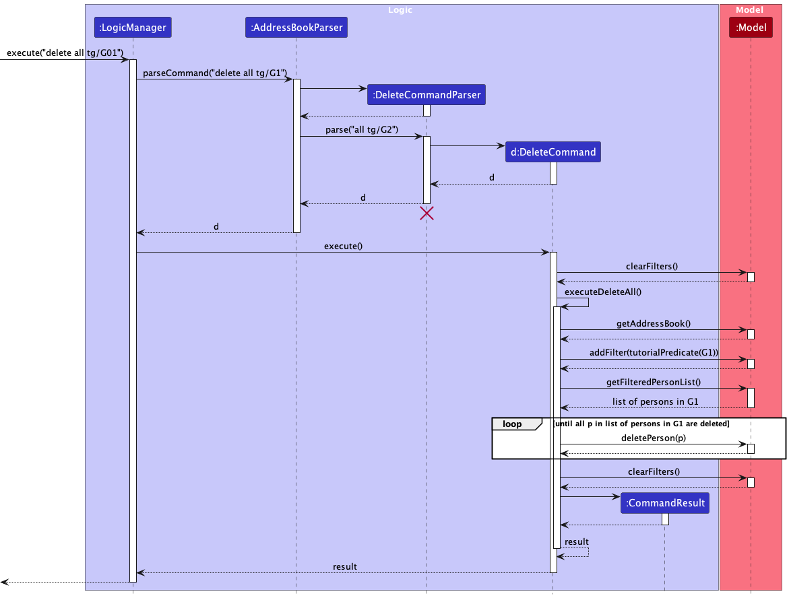
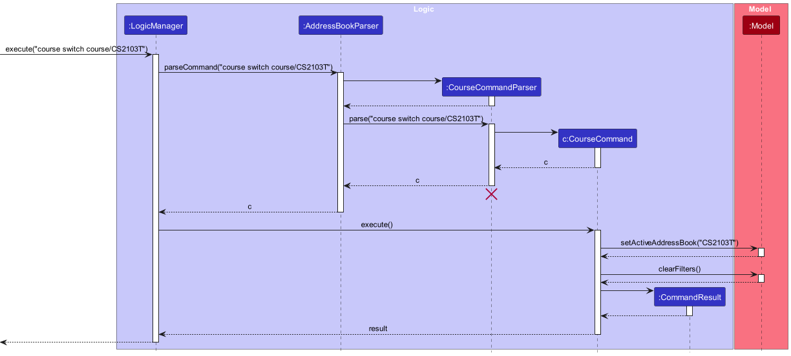

## Table of Contents
* [**Acknowledgements**](#acknowledgements) 
* [**Setting up, getting started**](#setting-up-getting-started) 
* [**Design**](#design) 
  * [Architecture](#architecture) 
  * [UI component](#ui-component) 
  * [Logic component](#logic-component) 
  * [Model component](#model-component) 
  * [Storage component](#storage-component) 
  * [Common classes](#common-classes) 
* [**Implementation**](#implementation)
  * [List features](#list-features)
  * [Mark attendance feature](#mark-attendance-feature)
  * [View Tallied Attendance feature](#view-tallied-attendance-feature)
  * [View Detailed Attendance Records feature](#view-detailed-attendance-records-feature)
  * [Find feature](#finding-a-person-find)
  * [Merge feature](#merging-two-students-merge)
  * [Delete features](#delete-features)
  * [Separate address book for each course](#separate-address-book-for-each-course)
  * [[Proposed] Undo/redo feature](#proposed-undoredo-feature) 
* [**Documentation, logging, testing, configuration, dev-ops**](#documentation-logging-testing-configuration-dev-ops) 
* [**Appendix: Requirements**](#appendix-requirements) 
  * [Product scope](#product-scope) 
  * [User stories](#user-stories) 
  * [Use cases](#use-cases) 
  * [Non-Functional Requirements](#non-functional-requirements) 
  * [Glossary](#glossary) 
* [**Appendix: Instructions for manual testing**](#appendix-instructions-for-manual-testing)
  * [Launch and shutdown](#launch-and-shutdown)
  * [Creating, editing and deleting a course](#creating-editing-and-deleting-a-course)
  * [Adding and editing a student](#adding-and-editing-a-student)
  * [Deleting a person](#deleting-a-person)
  * [Marking and Viewing Attendance](#marking-and-viewing-attendance)
  * [Saving Data](#saving-data)
* [**Appendix: Planned Enhancements**](#appendix-planned-enhancements)
* [**Appendix: Effort**](#appendix-effort)

--------------------------------------------------------------------------------------------------------------------

## **Acknowledgements**

This project is based on the AddressBook-Level3 project created by the [SE-EDU initiative](https://se-education.org).

--------------------------------------------------------------------------------------------------------------------

## **Setting up, getting started**

Refer to the guide [_Setting up and getting started_](SettingUp.md).

--------------------------------------------------------------------------------------------------------------------

## **Design**

:bulb: **Tip:** The `.puml` files used to create diagrams in this document `docs/diagrams` folder. Refer to the [_PlantUML Tutorial_ at se-edu/guides](https://se-education.org/guides/tutorials/plantUml.html) to learn how to create and edit diagrams.

### Architecture

The ***Architecture Diagram*** given above explains the high-level design of TAvigator.

Given below is a quick overview of main components and how they interact with each other.

**Main components of the architecture**

**`Main`** (consisting of classes [`Main`](https://github.com/se-edu/addressbook-level3/tree/master/src/main/java/seedu/address/Main.java) and [`MainApp`](https://github.com/se-edu/addressbook-level3/tree/master/src/main/java/seedu/address/MainApp.java)) is in charge of the app launch and shut down.
* At app launch, it initializes the other components in the correct sequence, and connects them up with each other.
* At shut down, it shuts down the other components and invokes cleanup methods where necessary.

The bulk of the app's work is done by the following four components:

* [**`UI`**](#ui-component): The UI of the App.
* [**`Logic`**](#logic-component): The command executor.
* [**`Model`**](#model-component): Holds the data of the App in memory.
* [**`Storage`**](#storage-component): Reads data from, and writes data to, the hard disk.

[**`Commons`**](#common-classes) represents a collection of classes used by multiple other components.

**How the architecture components interact with each other**

The *Sequence Diagram* below shows how the components interact with each other for the scenario where the user issues the command `delete 1`.

Each of the four main components (also shown in the diagram above),

* defines its *API* in an `interface` with the same name as the Component.
* implements its functionality using a concrete `{Component Name}Manager` class (which follows the corresponding API `interface` mentioned in the previous point).

For example, the `Logic` component defines its API in the `Logic.java` interface and implements its functionality using the `LogicManager.java` class which follows the `Logic` interface. Other components interact with a given component through its interface rather than the concrete class (reason: to prevent outside component's being coupled to the implementation of a component), as illustrated in the (partial) class diagram below.

The sections below give more details of each component.

### UI component

The **API** of this component is specified in [`Ui.java`](https://github.com/se-edu/addressbook-level3/tree/master/src/main/java/seedu/address/ui/Ui.java)

The UI consists of a `MainWindow` that is made up of parts e.g.`CommandBox`, `ResultDisplay`, `PersonListPanel`, `StatusBarFooter` etc. All these, including the `MainWindow`, inherit from the abstract `UiPart` class which captures the commonalities between classes that represent parts of the visible GUI.

The `UI` component uses the JavaFx UI framework. The layout of these UI parts are defined in matching `.fxml` files that are in the `src/main/resources/view` folder. For example, the layout of the [`MainWindow`](https://github.com/se-edu/addressbook-level3/tree/master/src/main/java/seedu/address/ui/MainWindow.java) is specified in [`MainWindow.fxml`](https://github.com/se-edu/addressbook-level3/tree/master/src/main/resources/view/MainWindow.fxml)

The `UI` component,

* executes user commands using the `Logic` component.
* listens for changes to `Model` data so that the UI can be updated with the modified data.
* keeps a reference to the `Logic` component, because the `UI` relies on the `Logic` to execute commands.
* depends on some classes in the `Model` component, as it displays `Person` object residing in the `Model`.

### Logic component

**API** : [`Logic.java`](https://github.com/se-edu/addressbook-level3/tree/master/src/main/java/seedu/address/logic/Logic.java)

Here's a (partial) class diagram of the `Logic` component:

The sequence diagram below illustrates the interactions within the `Logic` component, taking `execute("delete 1")` API call as an example.

:information_source: **Note:** The lifeline for `DeleteCommandParser` should end at the destroy marker (X) but due to a limitation of PlantUML, the lifeline reaches the end of diagram.

How the `Logic` component works:

1. When `Logic` is called upon to execute a command, it is passed to an `AddressBookParser` object which in turn creates a parser that matches the command (e.g., `DeleteCommandParser`) and uses it to parse the command.
2. This results in a `Command` object (more precisely, an object of one of its subclasses e.g., `DeleteCommand`) which is executed by the `LogicManager`.
3. The command can communicate with the `Model` when it is executed (e.g. to delete a person).
4. The result of the command execution is encapsulated as a `CommandResult` object which is returned back from `Logic`.

Here are the other classes in `Logic` (omitted from the class diagram above) that are used for parsing a user command:

How the parsing works:
* When called upon to parse a user command, the `AddressBookParser` class creates an `XYZCommandParser` (`XYZ` is a placeholder for the specific command name e.g., `AddCommandParser`) which uses the other classes shown above to parse the user command and create a `XYZCommand` object (e.g., `AddCommand`) which the `AddressBookParser` returns back as a `Command` object.
* All `XYZCommandParser` classes (e.g., `AddCommandParser`, `DeleteCommandParser`, ...) inherit from the `Parser` interface so that they can be treated similarly where possible e.g, during testing.

### Model component
**API** : [`Model.java`](https://github.com/se-edu/addressbook-level3/tree/master/src/main/java/seedu/address/model/Model.java)

The `Model` component,

* stores the address book data i.e., all `Person` objects (which are contained in a `UniquePersonList` object).
* stores the currently 'selected' `Person` objects (e.g., results of a search query) as a separate _filtered_ list which is exposed to outsiders as an unmodifiable `ObservableList<Person>` that can be 'observed' e.g. the UI can be bound to this list so that the UI automatically updates when the data in the list change.
* stores a `UserPref` object that represents the user’s preferences. This is exposed to the outside as a `ReadOnlyUserPref` objects.
* does not depend on any of the other three components (as the `Model` represents data entities of the domain, they should make sense on their own without depending on other components)

:information_source: **Note:** An alternative (arguably, a more OOP) model is given below. It has a `Tag` list in the `AddressBook`, which `Person` references. This allows `AddressBook` to only require one `Tag` object per unique tag, instead of each `Person` needing their own `Tag` objects. 

### Storage component

**API** : [`Storage.java`](https://github.com/se-edu/addressbook-level3/tree/master/src/main/java/seedu/address/storage/Storage.java)

The `Storage` component,
* can save both address book data and user preference data in JSON format, and read them back into corresponding objects.
* inherits from both `AddressBookStorage` and `UserPrefStorage`, which means it can be treated as either one (if only the functionality of only one is needed).
* depends on some classes in the `Model` component (because the `Storage` component's job is to save/retrieve objects that belong to the `Model`)

### Common classes

Classes used by multiple components are in the `seedu.addressbook.commons` package.

--------------------------------------------------------------------------------------------------------------------

## **Implementation**

This section describes some noteworthy details on how certain features are implemented.

### List features
Two types of list commands, `list students` and `list attendance`, have been implemented.
`list students` allows users to return to the full list of students who are in the active address book.
`list attendance` allows users to view a summary of the attendances for each week.

#### Implementation
Both list commands are parsed with `ListCommandParser`. If parsed successfully, it returns either
a `ListStudentsCommand` or `ListAttendanceCommand`.

The following is a class diagram depicting `ListCommand`, `ListStudentsCommand` and `ListAttendanceCommand`:

The following sequence diagram shows how `ListStudentsCommand` works:

In this example, the user enters `list students`.

:information_source: **Note:** The lifeline for `ListCommandParser` should end at the destroy marker (X) but due to a limitation of PlantUML, the lifeline reaches the end of diagram.

The following sequence diagram shows how `ListAttendanceCommand` works:

In this example, the user enters `list attendance w/1 tg/G2`, where there are valid students in Tutorial Group G2.

:information_source: **Note:** The lifeline for `ListCommandParser` should end at the destroy marker (X) but due to a limitation of PlantUML, the lifeline reaches the end of diagram.

The following activity diagram summarizes what happens when the user executes a `ListAttendanceCommand`.

#### Design considerations:
The current implementation of `ListAttendanceCommand` aims to provide a view of the attendance records for the week in a concise manner, 
by only showing a statistical summary of the attendances and the list of absentees. 
The tutorial group ID is also implemented as an optional field to give users greater flexibility.
Specific messages are also shown when attendances are not fully marked and when there are no students in a specified tutorial group
instead of a generic error message, which was implemented so that users can more easily rectify these mistakes.

#### Alternative implementations considered but not adopted:

- Using a different class structure for the `list` commands

  > Instead of separating `ListAttendanceCommand` and `ListStudentsCommand` into two classes that extend from `ListCommand`,
  > we could have used `ListCommand` only, splitting Attendance and Students into 2 cases.

  **Pros:**
    - Simplifies class structure.
    - Adds functionality to `ListCommand`: Currently `ListCommand` does not have any functionality and might be redundant.
  
  **Cons:**
    - Reduces OOP and extensibility: Current implementation allows for more `list` commands to be added easily.
  
  **Evaluation:**

  The current implementation is preferred as it has greater OOP and provides more extensibility. Future `list` commands can then be implemented more easily. The current implementation of `ListCommand` also has a unique `MESSAGE_USAGE` text, which reduces its redundancy.

- Different format for information shown by `ListAttendanceCommand`

  > Instead of the UI message showing the statistical summary of attendance and the model showing the list of absentees,
  > we could have the UI message show the statistical summary as well as the names of absentees and their reasons of absences and the model show the full list of students.

    **Pros:**
    - Allows the user to view the reason of absence immediately, which is currently in neither the UI message nor the model.
    
    **Cons:**
    - Causes UI message to become more cluttered and require more scrolling, which is not ideal, especially since it is supposed to be a summary.
    - Does not make full use of the model.
    
    **Evaluation:**

    The current implementation is preferred as it gives the user a clear and concise summary of the week's attendances, which is in line with the intention and design of the feature. If the user wants to know the reason of absence, they can use the `ViewCommand`.

### Mark attendance feature

#### Implementation

The mark attendance feature is implemented using the `MarkAttendanceCommand` class. It is parsed by the `MarkAttendanceCommandParser` class.
If parsed successfully, it returns a `MarkAttendanceCommand` object.

The following sequence diagram shows how the `MarkAttendanceCommand` works:

In this example, the user enters `mark`, followed by a string of arguments.

:information_source: **Note:** The lifeline for `MarkAttendanceCommandParser` should end at the destroy marker (X) but due to a limitation of PlantUML, the lifeline reaches the end of diagram.

The following activity diagram shows how the `MarkAttendanceCommand` works:

#### Design considerations:

`MarkAttendanceCommand` was implemented this way with the idea of providing flexibility to the user. By allowing user to mark attendance using either the student's name or ID, it caters to different user preferences. The check for existing attendance for the current week ensures that the user does not accidentally create duplicate records for the same week.

#### Alternative implementations considered but not adopted:

- Using a separate command for updating attendance

    > Instead of having the command handle both marking and updating attendance, we could have a separate command, say `UpdateAttendanceCommand`, to handle updates.

    **Pros:**
    - Easier to understand and maintain: Developers can quickly grasp the purpose of each command.

    **Cons:**
    - Increased complexity: Introducing more commands can make the system more complex and harder for users to remember.
    - Redundancy: Both commands would have overlapping code, leading to potential redundancy.

    **Evaluation:**

    The current implementation is preferred as it is simpler and more straightforward. It reduces the need for users to remember additional commands, while resolving potential user mistakes behind the scene, providing convenience and a better user experience. The additional complexity introduced by having a separate command for updating attendance is not justified.
    

- Not checking for same week's attendance

  > Instead of checking if the attendance for the same week, we could simply add a new attendance record every time the command is invoked.

  **Pros:**
    - Simplicity: Implementation would be straightforward without the need for additional checks.
    - Flexibility: Allows for multiple attendance records within the same week, which might be useful in some scenarios.

  **Cons:**
    - Redundancy: Multiple attendance records for the same week can lead to confusion and redundancy.
    - Inefficiency: Consumes more memory and might make querying slower if there are many redundant records.

  **Evaluation:**

  The current implementation is preferred as the pros simply do not outweigh the cons. The potential scenario that multiple attendance records within the same week being potentially useful is not justified as it is virtually unlikely to happen. The current implementation is much better preferred as the check prevents potential user mistakes behind the scene, providing convenience and a better user experience.

### View Tallied Attendance feature

#### Implementation

The tallied attendance feature is implemented as a method in the Person class, where attendance records are currently being stored as an arrayList of Attendance objects. The getTalliedAttendance method iterates through the attendance records to return the ratio of tutorials attended to the total number of tutorials.

#### Design considerations:

This feature is implemented this way, where it is displayed to the user without any additional commands, so that the user can quickly view a summary of the student's attendance records at a glance.

#### Alternative implementations considered but not adopted:

Another possible way to implement this feature would be to abstract the attendance records into a separate class.

**Pros:**

- Extendability: This method will increase the ease of implementing features relating to attendance in the future.

**Cons:**

- Redundancy: At the current stage, abstracting it into a separate class will greatly increase code complexity without bringing much convenience.

### View Detailed Attendance Records feature

#### Implementation

The view feature allows the user to view the detailed attendance records of the students in the contact list. This
feature is implemented using the `ViewCommand` class. It is parsed by the `ViewCommandParser` class. If parsed
successfully, it returns a `ViewCommand` object.

The following sequence diagram shows how the ViewCommand function works:

In this example, the user enters `view 1`.

:information_source: **Note:** The lifeline for `ViewCommandParser` should end at the destroy marker (X) but due to a limitation of PlantUML, the lifeline reaches the end of diagram.

The following activity diagram summarizes what happens when a user executes a ViewCommand:

#### Design considerations

The feature is implemented this way in order to access each individual's attendance records in a quick and efficient
manner. By using the index of the contact, the user need not type out the individual's full name, keeping the command
short and quick, especially when the user may have to view multiple attendance records in quick succession.

#### Alternative implementations considered but not adopted:

- Integrate the attendance records to be part of the UI

  > Instead of having the user to enter a command to view individual attendance records, we could have the attendance records being shown constantly on the UI for every single contact

  **Pros:**
    - Implementation would be quite straightforward and simple without having to add a new command `ViewCommand` and its parser `ViewCommandParser`.
    - Theoretically, users would be able to view every student's attendance records almost instantly.

  **Cons:**
    - The UI could end up being extremely cluttered especially considering that each student might have 13 rows of attendance to show. This could result in information overload and drastically reduce the user-friendliness of the UI.

  **Evaluation**:

  The current implementation, despite having to add new classes, is the optimal way to go about implementing this feature as we believe that having a user-friendly UI is a priority.

### Finding a person `find`

#### Implementation

This `find` feature allows the user to search for students in TAvigator courses either by the student's name or ID. The user also need not enter the student's full name and can simply enter prefixes. This feature is implemented using the `FindCommand` class and parsed by the `FindCommandParser` class. If parsed successfully, it returns a `FindCommand` object.

The following sequence diagram shows how the FindCommand function works:

In this example, the user enters `find n/Anthony`.

:information_source: **Note:** The lifeline for `FindCommandParser` should end at the destroy marker (X) but due to a limitation of PlantUML, the lifeline reaches the end of diagram.

The following activity diagram summarizes what happens when a user executes a ViewCommand:

#### Design considerations

The feature is implemented this way so that the user is able to access a particular student's contact quickly and conveniently without having to scroll through the entire course list. By allowing the user to search by prefixes or student IDs, there is a lot more freedom in terms of how the user wants to access the student's contact.

#### Alternative implementations considered but not adopted:

- Only allowing the user to find contacts by name

  > Instead of having the user to enter the prefix everytime they want to find a contact, the process can be sped up by narrowing the functionality of this command to only find by name.

  **Pros:**
    - Implementation would be quite straightforward and simple as the default `find` feature would suffice for the feature specifications.
    - The user need not enter the prefix everytime they want to use `find`, reducing the time taken to search for contacts.

  **Cons:**
    - The freedom of the user is limited greatly, considering that finding by student ID in a university is also rather common. By constraining them to a single search method, the user may end up spending more time finding students with longer names.

  **Evaluation**:

  The current implementation is the optimal way to go about implementing this feature as we believe that the value added by the feature triumphs the effort needed for implementation.

### Merging two students `merge`

#### Implementation

This `merge` feature allows the user to merge two students. The merged student will possess the NAME, EMAIL, PHONE NUMBER, and TUTORIAL GROUP ID of the primary student. The merged student will also have the tags of both students, and their merged attendance records.

The following sequence diagram shows how the MergeCommand function works:

In this example, the user enters `merge 1 2`.

:information_source: **Note:** The lifeline for `MergeCommandParser` should end at the destroy marker (X) but due to a limitation of PlantUML, the lifeline reaches the end of diagram.

The following activity diagram summarizes what happens when a user executes a MergeCommand:

#### Design considerations

The feature is implemented this way so that the user is able to quickly merge any duplicated students, without having to manually edit the student and add the tags and attendance records from one student to another.

#### Alternative implementations considered but not adopted:

- Editing the primary student instead of creating a new student.

  **Pros:**
    - Greater efficiency since there is less overhead in creating a new Person.

  **Cons:**
    - This implementation would mean that we have to increase the mutability of the Person class, which is undesirable.

  **Evaluation**:

  The current implementation is the optimal way to go about implementing this feature as we believe that there is greater value in preserving the immutability of the Person class.

### Delete features
Two types of delete commands, `delete INDEX` and `delete all`, have been implemented.
`delete INDEX` allows users delete a singular student via their index in the list.
`delete all` allows users to delete multiple students at once.

#### Implementation
Both delete commands are parsed with `DeleteCommandParser`. If parsed successfully, it returns a `DeleteCommand`.

The following sequence diagram shows how `DeleteCommand` works:

In this example, the user enters `delete all tg/G1`, where there are valid students in Tutorial Group G1.

:information_source: **Note:** The lifeline for `DeleteCommandParser` should end at the destroy marker (X) but due to a limitation of PlantUML, the lifeline reaches the end of diagram.

#### Design considerations:
`DeleteCommand` is implemented to give users greater flexibility, as it allows them to delete a student by index, delete multiple students in the course by tutorial group or delete all students in the course.
The ability to delete multiple students was chosen as it provides greater efficiency as compared to deleting students one by one.

#### Alternative implementations considered but not adopted:

- Different format for information shown by `DeleteCommand`

  > Instead of the UI message showing a success message followed by listing (all) the student(s) deleted,
  > we could have it showing a success message only.

  **Pros:**
    - Reduces clutter in the UI message.

  **Cons:**
    - Users would not know which students were deleted, especially when utilising `delete all` or `delete all tg/xx` on a large tutorial group.
    - Once the student is deleted, the user loses their information completely and would not be able to add them back easily.

  **Evaluation**:

  The current implementation is preferred as it is more user-friendly, and provides the user with valuable information. Listing the information of students deleted allows the user to be able to check if they deleted the correct students. If a student was deleted by mistake, the user can easily reference the UI message containing the student's information to add them back, ensuring a more reliable and user-friendly experience.

### Separate Address Book for each Course

#### Implementation

In the `ModelManager` class, instead of storing an `AddressBook`, we store a `AddressBookManager`.

The `AddressBookManager` has a few responsibilities:
- Adding or deleting `AddressBook`
- Setting the active `AddressBook`
- Getting the active `AddressBook`

Existing methods such as `saveAddressBook` in `AddressBookStorage` have been modified to store an `AddressBookManager` instead. The serialization and deserialization of `AddressBookManager` is also now handled by the nested `AddressBookManagerSerializer` class as well as `AddressBookManagerDeserializer` class within `AddressBookManager`. A `CourseCommand` is also added to facilitate the user switching address book, creating, deleting and editing them.

Course commands are parsed with `CourseCommandParser`. If parsed successfully, it returns a `CourseCommand`.

The following sequence diagram shows how `CourseCommand` works:

In this example, the user enters `course switch course/CS2103T`, to switch to another valid address book with course code "CS2103T".

:information_source: **Note:** The lifeline for `CourseCommandParser` should end at the destroy marker (X) but due to a limitation of PlantUML, the lifeline reaches the end of diagram.

#### Design considerations:

The `getAddressBook` method in `ModelManager` is now a wrapper for the `getActiveAddressBook` method in
`AddressBookManager`. This ensures that any existing commands will still "see" the model as having one `AddressBook`,
and not break any existing functionality.

#### Alternative implementations considered but not adopted:

- Updating the structure in `ModelManager`

  > Instead of having a new class `AddressBookManager`, we simply update the existing structure to use a
  > `HashMap<String, AddressBook>`.

  **Pros:**
    - Easier to understand: Developers who are new to the codebase do not need to learn and understand the
    `AddressBookManager` class and its interactions, which could potentially increase the learning curve for the codebase.

  **Cons:**
    - Harder to maintain: In the future, should any changes be needed for address book management, there may need to refactor a significant portion of the codebase, as the logic is distributed. This can be error-prone and time-consuming.
    - Harder to Store: Without a dedicated AddressBookManager class, there is a need to refactor a significant portion of the existing storage mechanism to take in a HashMap of `AddressBook`.

  **Evaluation:**
  The proposed implementation is preferred as even though it introduces additional complexity, it allows for better maintainability of the codebase as the responsibility of handling `AddressBook` is now handled by the `AddressBookManager` class. The ease of extensibility outweighs the complexity introduced.

### \[Proposed\] Undo/redo feature

#### Proposed Implementation

The proposed undo/redo mechanism is facilitated by `VersionedAddressBook`. It extends `AddressBook` with an undo/redo history, stored internally as an `addressBookStateList` and `currentStatePointer`. Additionally, it implements the following operations:

* `VersionedAddressBook#commit()` — Saves the current address book state in its history.
* `VersionedAddressBook#undo()` — Restores the previous address book state from its history.
* `VersionedAddressBook#redo()` — Restores a previously undone address book state from its history.

These operations are exposed in the `Model` interface as `Model#commitAddressBook()`, `Model#undoAddressBook()` and `Model#redoAddressBook()` respectively.

Given below is an example usage scenario and how the undo/redo mechanism behaves at each step.

Step 1. The user launches the application for the first time. The `VersionedAddressBook` will be initialized with the initial address book state, and the `currentStatePointer` pointing to that single address book state.

Step 2. The user executes `delete 5` command to delete the 5th person in the address book. The `delete` command calls `Model#commitAddressBook()`, causing the modified state of the address book after the `delete 5` command executes to be saved in the `addressBookStateList`, and the `currentStatePointer` is shifted to the newly inserted address book state.

Step 3. The user executes `add n/David …​` to add a new person. The `add` command also calls `Model#commitAddressBook()`, causing another modified address book state to be saved into the `addressBookStateList`.

:information_source: **Note:** If a command fails its execution, it will not call `Model#commitAddressBook()`, so the address book state will not be saved into the `addressBookStateList`.

Step 4. The user now decides that adding the person was a mistake, and decides to undo that action by executing the `undo` command. The `undo` command will call `Model#undoAddressBook()`, which will shift the `currentStatePointer` once to the left, pointing it to the previous address book state, and restores the address book to that state.

:information_source: **Note:** If the `currentStatePointer` is at index 0, pointing to the initial AddressBook state, then there are no previous AddressBook states to restore. The `undo` command uses `Model#canUndoAddressBook()` to check if this is the case. If so, it will return an error to the user rather
than attempting to perform the undo.

The following sequence diagram shows how the undo operation works:

:information_source: **Note:** The lifeline for `UndoCommand` should end at the destroy marker (X) but due to a limitation of PlantUML, the lifeline reaches the end of diagram.

The `redo` command does the opposite — it calls `Model#redoAddressBook()`, which shifts the `currentStatePointer` once to the right, pointing to the previously undone state, and restores the address book to that state.

:information_source: **Note:** If the `currentStatePointer` is at index `addressBookStateList.size() - 1`, pointing to the latest address book state, then there are no undone AddressBook states to restore. The `redo` command uses `Model#canRedoAddressBook()` to check if this is the case. If so, it will return an error to the user rather than attempting to perform the redo.

Step 5. The user then decides to execute the command `list`. Commands that do not modify the address book, such as `list`, will usually not call `Model#commitAddressBook()`, `Model#undoAddressBook()` or `Model#redoAddressBook()`. Thus, the `addressBookStateList` remains unchanged.

Step 6. The user executes `clear`, which calls `Model#commitAddressBook()`. Since the `currentStatePointer` is not pointing at the end of the `addressBookStateList`, all address book states after the `currentStatePointer` will be purged. Reason: It no longer makes sense to redo the `add n/David …​` command. This is the behavior that most modern desktop applications follow.

The following activity diagram summarizes what happens when a user executes a new command:

#### Design considerations:

**Aspect: How undo & redo executes:**

* **Alternative 1 (current choice):** Saves the entire address book.
    * Pros: Easy to implement.
    * Cons: May have performance issues in terms of memory usage.

* **Alternative 2:** Individual command knows how to undo/redo by
  itself.
    * Pros: Will use less memory (e.g. for `delete`, just save the person being deleted).
    * Cons: We must ensure that the implementation of each individual command are correct.

--------------------------------------------------------------------------------------------------------------------

## **Documentation, logging, testing, configuration, dev-ops**

* [Documentation guide](Documentation.md)
* [Testing guide](Testing.md)
* [Logging guide](Logging.md)
* [Configuration guide](Configuration.md)
* [DevOps guide](DevOps.md)

--------------------------------------------------------------------------------------------------------------------

## **Appendix: Requirements**

### Product scope

**Target user profile**:

* is a Teaching Assistant (TA) for National University of Singapore Computer Science modules
* has a need to manage a significant number of student information
* prefer desktop apps over other types
* can type fast
* prefers typing to mouse interactions
* is reasonably comfortable using CLI apps

**Value proposition**: provide a convenient one-stop platform for tutors to keep track of the work submission and attendance of each student

### User stories

Priorities: High (must have) - `* * *`, Medium (nice to have) - `* *`, Low (unlikely to have) - `*`

| Priority | As a …​         | I want to …​                                                       | So that I can…​                                                                            |
|----------|-----------------|--------------------------------------------------------------------|--------------------------------------------------------------------------------------------|
| `* * *`  | meticulous user | mark attendance for each student separately                        | make sure each students' attendance record is accurate                                     |
| `* * *`  | user            | see a summary of attendance records                                | verify the attendance records                                                              |
| `* * *`  | user            | easily create new or edit contacts                                 | easily add or remove contacts                                                              |
| `* * *`  | user            | search for a student by name or student ID                         | quickly access their attendance and assignment records                                     |
| `* * *`  | user            | view a list of all my students                                     | quickly scan who's in my tutorial groups                                                   |
| `* * *`  | user            | filter for specific tutorial groups                                | efficiently engage in tutorial-group-based tasks such as marking attendance after a lesson |
| `* *`    | frequent user   | organise my students' contacts by modules                          | better manage my students                                                                  |
| `* *`    | forgetful user  | add additional notes for my students                               | better remember my students                                                                |
| `* *`    | user            | indicate reason for absence                                        | know when there is a valid excuse                                                          |
| `* *`    | user            | be able to search for contacts using keywords (modules)            | more easily find contacts                                                                  |
| `* *`    | user            | categorize students into different tutorial groups                 | manage and monitor each group efficiently                                                  |
| `* *`    | user            | view the tallied attendance over the semester of each student      | submit their overall attendance mark quickly                                               |
| `* *`    | user            | remove students from the address book                              | avoid having unnecessary contacts                                                          |
| `* *`    | impatient user  | mass mark attendance for all my students                           | mark attendance more efficiently                                                           |
| `* *`    | long-term user  | delete all contacts from tutorial group at once                    | avoid doing so one-by-one after the module ends                                            |
| `* *`    | long-term user  | archive past module records                                        | have a less cluttered workspace                                                            |
| `* *`    | new user        | have the application feel intuitive                                | easily learn the various functions                                                         |
| `* *`    | careless user   | undo my last action                                                | recover any important data                                                                 |
| `*`      | new user        | import my contacts from another database                           | easily get started using the app                                                           |
| `*`      | user            | export my attendance records to another database                   | easily upload attendance records                                                           |
| `*`      | forgetful user  | be reminded on incomplete attendance records                       | rectify any potential gaps in the records                                                  |
| `*`      | user            | add pictures to the contacts                                       | easily identify my students                                                                |
| `*`      | forgetful user  | merge duplicate contacts                                           | avoid having duplicate contacts jamming up the application                                 |
| `*`      | busy user       | set reminders if I have a meeting with the student                 | remember all one-on-one meetings that I have with the students                             |
| `*`      | user            | view a count of how many sessions each student has missed          | identify frequent absentees                                                                |
| `*`      | user            | add simple notes next to a student's name (like "late submission") | remember specific incidents                                                                |
| `*`      | user            | add and edit status of work submissions                            | keep track of the students’ work                                                           |
| `*`      | user            | track the submission status of each student's assignments          | be aware of who has or hasn't turned in their work                                         |
| `*`      | user            | add and view my student’s preferred name                           | call on them with the correct name                                                         |

### Use cases

(For all use cases below, the **System** is `TAvigator` and the **Actor** is the `user`, unless specified otherwise)

**Use case: UC01 - Creating and editing a new address book**

**MSS**

1. User creates a new address book with a valid course code.

   Use case ends.

**Extensions**

* 1a. User edits the course code.
      Use case ends. 

* 1b. User enters an invalid course code.
  * 1b1. TAvigator prompts the user to enter a valid course code.
  
      Use case ends.

**Use case: UC02 - Switching to a different address book**

**MSS**

1. User switches to a different address book.

   Use case ends.

**Extensions**

* 1a. The address book that the user is trying to switch to does not exist.
  * 1a1. TAvigator prompts the user to switch to a valid address book.

  Use case ends.

**Use case: UC03 - Creating a new contact and editing relevant information**

**Precondition**: User is on a course address book.

**MSS**

1. User creates a new contact.

    Use case ends.

**Extensions**

* 1a. User edits the contact details.
      Use case ends. 

* 1b. User finds a duplicated contact.
  * 1b1. User merges the duplicated contacts.
      Use case ends. 

**Use case: UC04 - View Summary of Attendance Records**

**Precondition**: User is on a course address book. 

**MSS**

1.  User requests to view a summary of attendance records and enters a week and a tutorial group ID.
2.  TAvigator shows a summary of attendance records for the corresponding week and tutorial group.

    Use case ends.

**Extensions**

* 1a. User leaves the tutorial group ID blank.
    * 1a1. TAvigator shows a summary of attendance records of all students in the course for the week specified.

    Use case ends.

* 1b. User leaves the week blank.
    * 1b1. TAvigator shows an error message.

    Use case ends.

* 1c. User enters an invalid tutorial group ID.
    * 1c1. TAvigator shows an error message.

    Use case ends.

* 1d. User enters a tutorial group with no students in it.
    * 1d1. TAvigator shows a reminder that no students are in the tutorial group and shows no students.

    Use case ends.

**Use case: UC05 - View List of Students**

**Precondition**: User is on a course address book.

**MSS**

1.  User requests to view a list of students.
2.  TAvigator shows a list of all students in the course.

    Use case ends.

**Use case: UC06 - Mark Student Attendance Separately**

**Precondition**: User is on a course address book.

**MSS**

1.  User requests to mark attendance for a student and enters student name or ID, followed by the attendance status and week and reason if any.
2.  TAvigator marks the attendance of student and displays message for confirmation of attendance.
  
    Use case ends.

**Extensions**

* 1a. The given student name or ID is invalid.
    * 1a1. TAvigator shows an error message.

      Use case ends.

* 1b. The given attendance record is invalid.
    * 1b1. TAvigator shows an error message.

      Use case ends.

* 1c. The given week is invalid.
    * 1c1. TAvigator shows an error message.

      Use case ends.

* 1d. The no reason provided for absence.
    * 1d1. TAvigator shows an error message.

      Use case ends.

**Use case: UC07 - Search For Contacts via Student Name or ID**

**Precondition**: User is on a course address book.

**MSS**

1. User requests to search for a contact via student name or ID.
2. User enters desired student name or ID.
3. TAvigator shows list of students with matching name or ID.

    Use case ends.

**Extensions**

* 3a. The given ID or name does not exist.
    * 3a1. TAvigator shows message indicating that contacts with the specified names or ID do not exist.

      Use case ends.

* 3b. User leaves the student name or ID blank
    * 3b1. TAvigator shows an error message.

      Use case ends.

* 3c. User enters an invalid student name or ID
    * 3c1. TAvigator shows an error message.

      Use case ends.

**Use case: UC08 - Delete a Student**

**Precondition**: User is on a course address book.

**MSS**

1. User requests to list students.
2. TAvigator shows a list of students.
3. User requests to delete a specific student in the list by entering the index corresponding to their position in the list.
4. TAvigator deletes the student.

   Use case ends.

**Extensions**

* 2a. The list is empty.
    
    Use case ends.

* 3b. User enters an invalid index.
    * 3b1. TAvigator shows an error message.

    Use case resumes at step 2.

**Use case: UC09 - Delete Multiple Students**

**Precondition**: User is on a course address book.

**MSS**

1. User requests to delete students and enters a tutorial group to delete.
2. TAvigator deletes all students from the tutorial group in the course.

   Use case ends.

**Extensions**

* 1a. User leaves the tutorial group blank.
    * 1a1. TAvigator deletes all students in the course.
      
        Use case ends.

* 1b. User enters an invalid tutorial group ID.
    * 1b1. TAvigator shows an error message.

      Use case ends.

* 1c. User enters a tutorial group with no students in it.
    * 1b1. TAvigator shows a reminder that no students are in the tutorial group and shows a list of all students in the course.

      Use case ends.

### Non-Functional Requirements

1.  Should work on any _mainstream OS_ as long as it has Java `11` or above installed.
2.  Should be able to hold up to 1000 persons without a noticeable sluggishness in performance for typical usage.
3.  A user with above average typing speed for regular English text (i.e. not code, not system admin commands) should be able to accomplish most of the tasks faster using commands than using the mouse.
4.  Should retain a majority of the core functionality even without internet access
5.  Application should not exceed file size of 50MB
6.  Should respond to user inputs within approximately 2 seconds
7.  Should show understandable messages to users and not crash under recoverable errors
8.  Application should have an intuitive and user-friendly interface, following design principles
9.  Should provide clear and comprehensive user documentation to assist users in using the application effectively
10. Should maintain technical documentation for developers, detailing the software architecture

### Glossary

* **Mainstream OS**: Windows, Linux, Unix, OS-X
* **Private contact detail**: A contact detail that is not meant to be shared with others

--------------------------------------------------------------------------------------------------------------------

## **Appendix: Instructions for manual testing**

Given below are instructions to test the app manually.

:information_source: **Note:** These instructions only provide a starting point for testers to work on;
testers are expected to do more *exploratory* testing.

### Launch and shutdown

1. Initial launch

    1. Download the jar file and copy into an empty folder

    2. Open a terminal tab and navigate to the same folder that contains the jar file
   
    3. Run the jar file with the command `java -jar tavigator.jar` 
       Expected: Shows the GUI with a set of sample courses and students. The window size may not be optimum.

2. Saving window preferences

    1. Resize the window to an optimum size. Move the window to a different location. Close the window.

    2. Re-launch the app. 
       Expected: The most recent window size and location is retained.

3. Exiting the app

    1. The application can be exited with the `exit` command, or simply clicking the exit button of the tab.

### Creating, editing and deleting a course.

1. Test case: `course create course/CS2040S`  
   Expected: A new course with the name "CS2040S" is created, and appears in the navigation bar.

2. Test case: `course edit course/CS2040`  
   Expected: The currently active course should be renamed to "CS2040".

3. Test case: `course delete course/CS2040`  
   Expected: The course with name "CS2040" should be deleted. If CS2040 is the currently active course, the GUI should update to display another present course.

### Adding and editing a student.

1. Test case: `add n/Fu Yiqiao p/91234567 e/fyq@gmail.com id/A1234569E t/G2`
   Expected: A new student is created under the currently active course, and added to the end of the list. (Provided there is no other student with the same ID)

2. Test case: `add n/9 p/91234567 e/fyq@gmail.com id/A1234569A t/G2`
   Expected: No new student added, error message displayed (Names should only contain alphabetical characters and spaces, and it should not be blank)

3. Test case: `add n/Fu Yiqiao p/91234567 e/fyq@gmail.com id/1234569E t/G2`
   Expected: No new student added, error message displayed (Please enter the full ID! IDs should only contain alphanumeric characters, with no special characters or space, and it should not be blank)

4. Test case: `edit 1 n/Tan Liyan`
   Expected: The name of the first person should be edited to be Tan Liyan.

5. Test case: `edit 1 n/9`
   Expected: No edit made, error message displayed (Names should only contain alphabetical characters and spaces, and it should not be blank)

### Deleting a person

1. Deleting a person while all persons are being shown

    1. Prerequisites: List all persons using the `list` command. Multiple persons in the list.

    2. Test case: `delete 1` 
       Expected: First contact is deleted from the list. Details of the deleted contact shown in the status message. Timestamp in the status bar is updated.

    3. Test case: `delete 0` 
       Expected: No person is deleted. Error details shown in the status message. Status bar remains the same.

    4. Test case: `delete all tg/G2` 
       Expected: All students from tutorial group G02 in the currently selected course are deleted.

    5. Test case: `delete all` 
       Expected: All students in the currently selected course are deleted.

    6. Other incorrect delete commands to try: `delete`, `delete x`, `...` (where x is larger than the list size) 
       Expected: Similar to previous.

### Marking and Viewing Attendance

1. Test case: `mark n/Zong Jin, Fu Yiqiao a/1 w/1`
   Expected: Marks students named, Zong Jin and Fu Yiqiao, as present for the tutorial in Week 1. Tallied attendance display should update accordingly.

2. Test case: `mark n/Zong Jin a/0 w/2 r/not feeling well`
   Expected: Marks student named Zong Jin as not present for the tutorial in Week 2. Tallied attendance display should update accordingly.

3. Test case: `mark n/Zong Jin a/0 w/2`
   Expected: No attendance marked. Error message displayed.

4. Test case: `mark n/Zong Jin a/1 w/2`
   Expected: Attendance of Zong Jin in week 2 should be updated to present. Tallied attendance display should update accordingly.

5. Test case: `mark n/Zong Jin a/2 w/2`
   Expected: No attendance marked. Error message displayed (Attendance should only be 0 or 1, where 0 indicates student is absent and 1 indicates student is present).

6. Test case: `mark n/Zong Jin a/2 w/15`
   Expected: No attendance marked. Error message displayed (Week should be an integer from 0 to 13).

7. Test case: `view 1`
   Expected: Displays the detailed attendance records for the first student in the currently displayed list.

8. Test case: `mark n/Zong Jin, Fu Yiqiao id/A0123456E, A0123457E a/1 w/1`
   Expected: No attendance marked. Error message displayed.

### Saving data

1. Dealing with missing/corrupted data files

   1. Ensure that the data/tavigator.json file is present in the same directory where the jar file is located. Else, launch the application and exit.
   2. To simulate missing data files, delete the json file.
      > Expected behaviour: TAvigator starts with preloaded courses and students.
   3. To simulate a corrupted data file, use a text editor to edit the json file.
      > Expected behaviour: TAvigator should fail to launch.

## **Appendix: Planned Enhancements**

Given below are some of the possible enhancements that could be added in future iterations:
1. More flexibility in student names.
    > Currently, student names cannot contain any special characters like `,` or `-` that might exist in some names. We plan to allow specific special characters for student names in future developments.
2. More detailed error messages for mark command.
   > The current error message for a failed `mark` command may be too general. We plan to add details to the error message that explains the reason of failure especially when reason of absence is not provided for students who are marked as absent: `Reason of absence (r/) is mandatory for students who are marked as absent`.
3. Stricter validation checks for course codes.
   > Validation checks could be added for course names to ensure valid course names when adding or editing courses. A valid format would include two to three initial alphabetical letters, followed by four numbers and one optional alphabetical letter at the end. A valid example would be `CS2103T`.
   > An alternative could be getting a list of course codes from the NUSMods API but that may require constant updating.
4. Importing records.
   > We plan to implement importing student records from a csv file in the future, which may create duplicated records. This would be where our merge command comes into play, merging duplicated records so that no information is lost.
5. More functionality for `mark` command.
   > Currently `mark` command's design does not encompass a few nice-to-haves. We plan to add support for the following:
   >   - Marking of students with the same student name.
   >   - Marking of students with both student name field and student ID field.
   >   - Marking of students with case-insensitive student name.
   >   - Marking of students using the index in list.
6. Marking attendance based on tutorial group instead of student.
   > Currently, TAvigator supports a student having multiple tutorial groups, but attendance is marked based on the student only. As such, we plan to modify the `mark` command so that it takes in a `tg/` input, and attendance can be marked separately for each tutorial group the student belongs to.
7. Better parsing of invalid arguments.
   > Currently, adding invalid and redundant prefixes after commands will cause TAvigator to take the invalid prefix and its value as part of the value of the closest valid prefix.  
   > For example, `add n/Fu Yiqiao p/98765432 e/fyq@example.com id/ A1234567M t/G2 r/` returns an error message that: Tutorial Group IDs should be alphanumeric.
   > The correct error message that should be shown is: Invalid prefix r/ detected.
8. Improved parsing of duplicated predicates.
   > Some commands in our app allows for duplicate inputs, such w/1 w/2 w/3, and takes the last one as the input to be parsed. In the future, we plan to disallow this type of inputs.
9. Improved UI for attendance records
   > Currently, it displays the attendance records in multiple lines and require scrolling, which makes it hard to view all information at a glance.
   > We plan to improve the UI by either showing the attendance records using boxes instead, with colours differentiating the different status for their attendance, such as using green for present, red for absent and grey for unmarked.
10. Standardise prefix for tutorial group
   > Currently, `add` and `edit` command uses `t/` prefix while `list attendance` and `delete all` uses the `tg/` prefix.
   > We plan to standardise the prefix to use the `tg/` prefix to avoid confusion.

## **Appendix: Effort**

### Effort required

#### Adding support for multiple address books

One of the major changes of TAvigator was the implementation of multiple address books, instead of AB3's singular address book. 
[Details of implementation can be found here.](#separate-address-book-for-each-course)
This required significant code restructuring, as well as new classes such as the `AddressBookManager` added in order to support this feature
[(PR)](https://github.com/AY2324S1-CS2103T-T09-4/tp/pull/96).
The UI also had to be updated accordingly to allows the user to easily switch between different address books.

#### More Viewing Options

TAvigator has also added support for more viewing options of the list of students.
This is implemented in the form of more serializable predicates, which are used to check for conditions such as: 
whether a student is absent from tutorial, whether a tutorial group contains a keyword, whether a name contains a keyword, 
and whether an ID contains a keyword. These predicates allow the user to view students not only by name, but also by ID, 
tutorial group, and attendance records. We went a step further to save the last viewing option in the preferences.json file, 
so that the user will be able to quickly refer back to their last viewed option on startup.

### Challenges faced

During the initial phase, it took us considerable amount of time to familiarise ourselves with the code base, and learn 
our ways around the layers of abstractions, as well as how the different components interacted with each other.
As we progressed and moved on to more complex implementations, we realised that sometimes our planned features were 
interdependent, meaning that we were left with tight and consecutive windows to implement our individual features.

Most importantly, we slowly learnt to communicate better through the process. This really helped to move our project 
forward as we were more comfortable sharing our opinions on each other thoughts, boosting our efficiency as a whole.

### Achievements

Despite all the challenges faced and all the time and effort it took to polish our project, we are proud to present 
TAvigator. We hope that TAvigator will become a one stop solution that will benefit all SOC TAs. 
