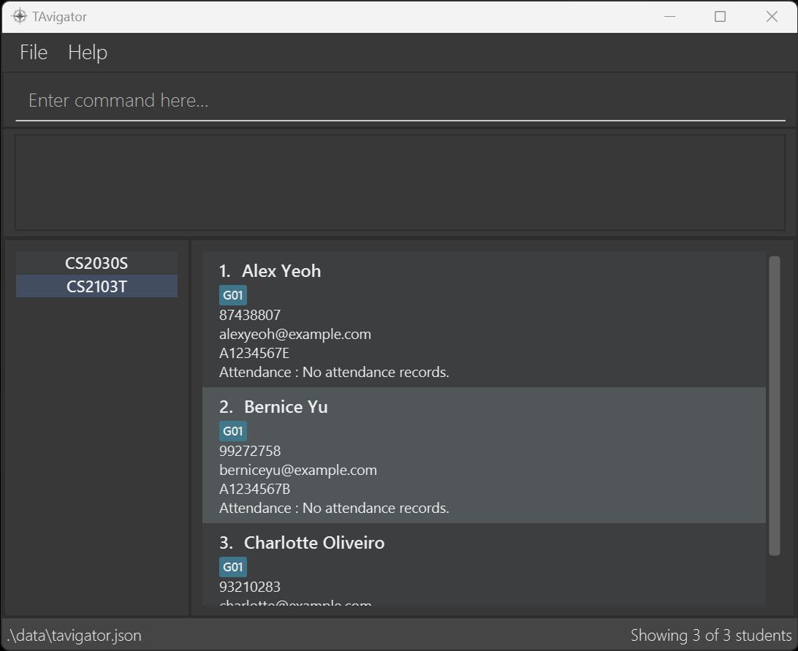
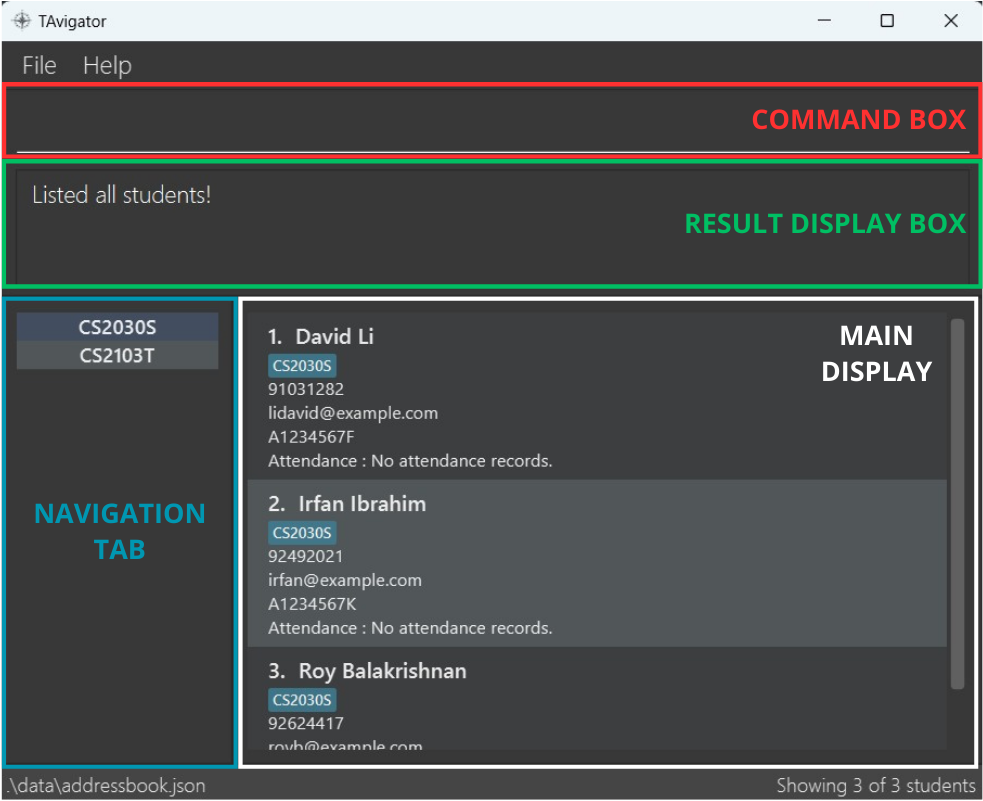
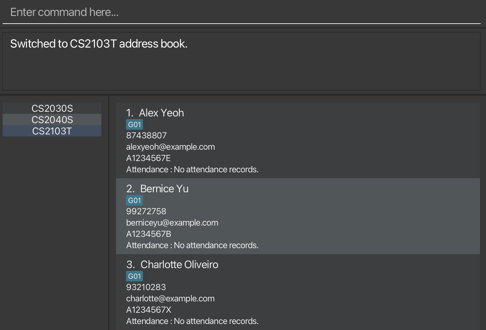
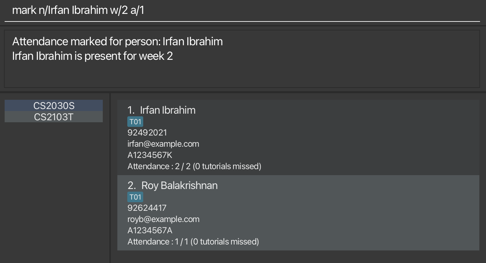
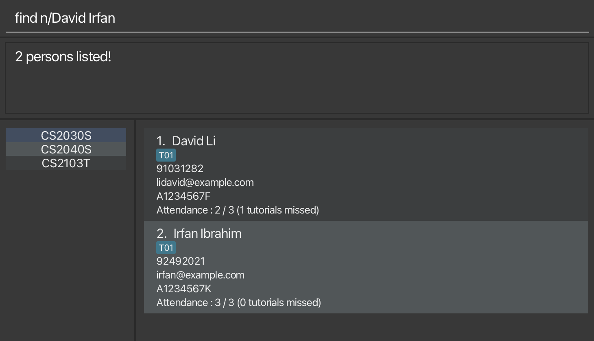
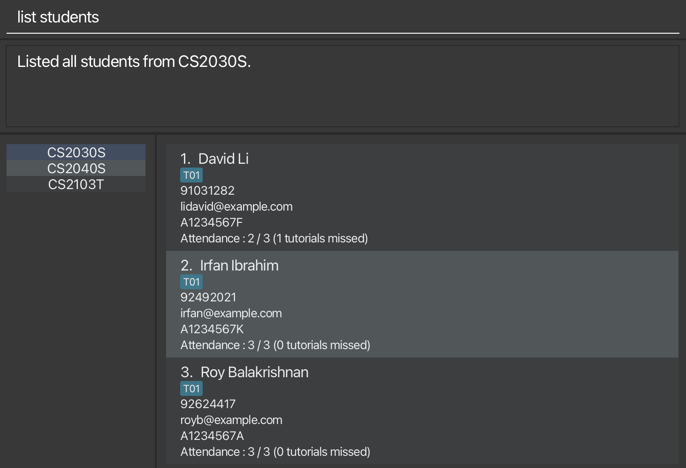
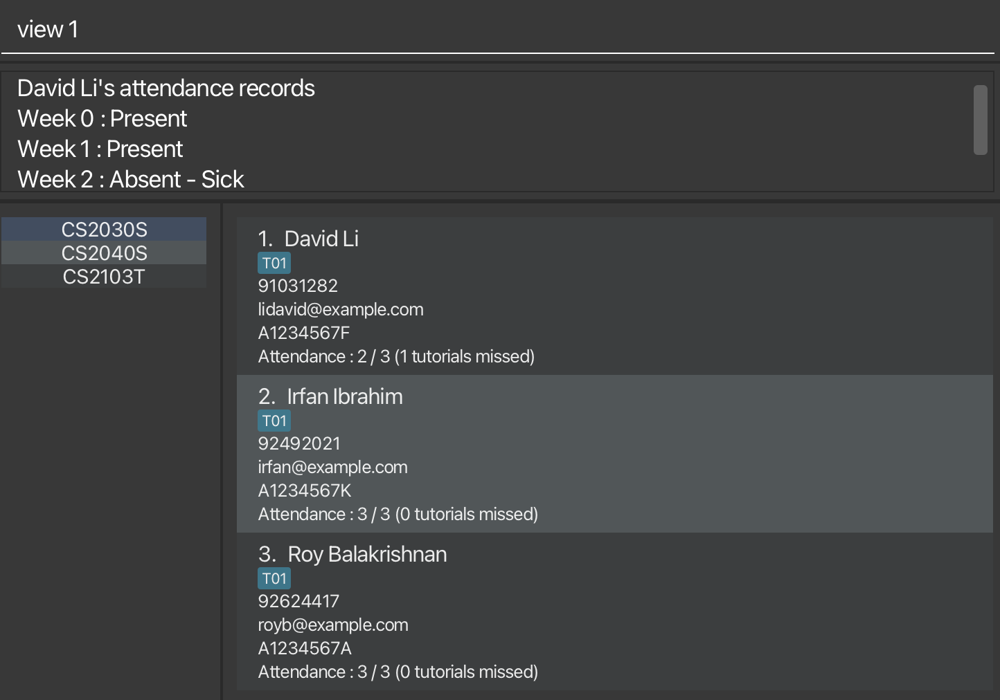

## 1. Introduction

TAvigator is a **desktop app** targeted towards Teaching Assistants **for managing contacts, optimized for use via a
Command Line Interface** (CLI) while still having the benefits of a Graphical User Interface (GUI). If you can type
fast, TAvigator can get your contact management tasks done faster than traditional GUI apps. We offer a one-stop
solution to manage your student details, including attendance records and assignment details.

### Table of Contents

- [1. Introduction](#1-introduction)
- [2. About this User Guide](#2-about-this-user-guide)
  - [2.1 Navigating the User Guide](#21-navigating-the-user-guide)
- [3. Quick start](#3-quick-start)
  - [3.1 Prerequisites](#31-prerequisites)
  - [3.2 Installation](#32-installation)
  - [3.3 Utilization](#33-utilization)
  - [3.4 Navigating the GUI](#34-navigating-the-gui)
- [4. Features](#4-features)
  - [4.1 Viewing Help](#41-viewing-help)
  - [4.2 Basic Course Management](#42-basic-course-management)
    - [4.2.1 Creating an addressbook: `course create`](#421-creating-an-addressbook-course-create)
    - [4.2.2 Deleting an addressbook: `course delete`](#422-deleting-an-addressbook-course-delete)
    - [4.2.3 Switching an addressbook: `course switch`](#423-switching-an-addressbook-course-switch)
    - [4.2.4 Editing an addressbook: `course edit`](#424-editing-an-addressbook-course-edit)
  - [4.3 Basic Student Management](#43-basic-student-management)
    - [4.3.1 Adding a new contact: `add`](#431-adding-a-new-contact-add)
    - [4.3.2 Editing a contact : `edit`](#432-editing-a-contact--edit)
    - [4.3.3 Marking attendance of student: `mark`](#433-marking-attendance-of-student-mark)
    - [4.3.4 Viewing summary of attendance : `list attendance`](#434-viewing-summary-of-attendance--list-attendance)
    - [4.3.5 Searching for student's contact via keyword : `find`](#435-searching-for-students-contact-via-keyword--find)
    - [4.3.6 Listing students : `list students`](#436-listing-students--list-students)
    - [4.3.7 Deleting a student : `delete`](#437-deleting-a-student--delete)
    - [4.3.8 Deleting multiple students : `delete all`](#438-deleting-multiple-students--delete-all)
    - [4.3.9 Merging two students : `merge`](#439-merging-two-students--merge)
    - [4.3.10 Viewing detailed attendance records : `view`](#4310-viewing-detailed-attendance-records--view)
  - [4.4 Exiting Program](#44-exiting-program)
  - [4.5 Data Management](#45-data-management)
    - [4.5.1 Saving the data](#451-saving-the-data)
    - [4.5.2 Editing the data file](#452-editing-the-data-file)
    - [4.5.3 Archiving data files `[coming in v2.0]`](#453-archiving-data-files-coming-in-v20)
- [5. FAQ](#5-faq)
- [6. Known issues](#6-known-issues)
- [7. Summary](#7-summary)
  - [7.1 Prefix Summary](#71-prefix-summary)
  - [7.2 Command Summary](#72-command-summary)
    - [7.2.1 Basic Course Management](#721-basic-course-management-commands)
    - [7.2.2 Basic Student Management](#722-basic-student-management-commands)

--------------------------------------------------------------------------------------------------------------------
## 2. About this User Guide

This guide aims to
* Teach first-time users how to start using TAvigator
* Explain the features of each command and how to use them.
* Provides a summary of the:
    * Available commands with their respective formats
    * Available prefixes and which commands use which prefixes

### 2.1 Navigating the User Guide
**Information Box**
<div markdown="block" class="alert alert-info">**:information_source: Info:**
I am an example info box! I provide useful information.
</div>

**Tip Box**
<div markdown="block" class="alert alert-success">**:bulb: Tip:**
I am an example tip box! I provide pointers to advanced users to enhance experience.
</div>

**Warning Box**
<div markdown="block" class="alert alert-warning">
**:exclamation: Caution:** I am an example warning box! I show important messages to take note to avoid any unintended effects.
</div>

## 3. Quick start

### 3.1 Prerequisites

Ensure you have Java `11` or above installed in your Computer.

<div markdown="block" class="alert alert-success">
**:bulb: Tip:** **Not sure how to check your Java version?**

**Step 1.** Open up **Command Prompt** (Windows) or **Terminal** (Mac and Linux).

**Step 2.** Type and run the command `java -version`.

**Step 3.** Check the version number provided (`xxx`) is at least `11`.

An example is shown below.

  ```
  > java -version
  java version "xxx" <Other information>
  ```
</div>

### 3.2 Installation

1. Download the latest `tavigator.jar` from [here](https://github.com/AY2324S1-CS2103T-T09-4/tp/releases).

2. Copy the file to the folder you want to use as the _home folder_ for your TAvigator.

3. Open a command terminal, `cd` into the folder you put the jar file in, and use the `java -jar tavigator.jar` command to run the application.<br>

    <div markdown="block" class="alert alert-success">
    **:bulb: Tip:** **Not sure how to check your Java version?**
    
    **Step 1.** Open up **Command Prompt** (Windows) or **Terminal** (Mac and Linux).
    
    **Step 2.** Type the command `java -jar ` (Note the space at the end). 
    
    **Step 3.** Drag the `tavigator.jar` file into the terminal and press Enter.
    
    An example of the final resulting command is shown below.
    
      ```
      > java -jar /Users/johndoe/Downloads/tavigator.jar
      ```
    </div>

   A GUI similar to the below should appear in a few seconds. Note how the app contains some sample data.<br>

   

### 3.3 Utilization

Type the command in the command box and press Enter to execute it. e.g. typing **`help`** and pressing Enter will open the help window.<br>
   Some example commands you can try:

   * `list students` : Lists all students in the current course.

   * `add n/Fu Yiqiao p/91234567 e/fyq@gmail.com id/A1234567M t/G10` : Adds a contact named `Fu Yiqiao` to TAvigator.

   * `delete 3` : Deletes the 3rd contact shown in the current list.

   * `exit` : Exits the app.

Refer to the [Features](#4-features) below for details of each command.

### 3.4 Navigating the GUI



**<span style="color:red;">Command Box</span>**<br>
Enter your command here.

**<span style="color:mediumseagreen;">Result Display Box</span>**<br>
Displays a feedback message after a command is executed.

**<span style="color:dodgerblue;">Navigation Tab</span>**<br>
Displays the  course tabs that you can navigate to.

**<span style="color:grey;">Main Display</span>**<br>
Displays the list of your chosen tab.

--------------------------------------------------------------------------------------------------------------------

## 4. Features

<div markdown="block" class="alert alert-info">

**:information_source: Notes about the command format:**<br>

* Words in `UPPER_CASE` are the parameters to be supplied by the user.<br>
  e.g. in `add n/NAME`, `NAME` is a parameter which can be used as `add n/John Doe`.

* Items in square brackets are optional.<br>
  e.g `n/NAME [t/TUTORIAL_GROUP_ID]` can be used as `n/John Doe t/G01` or as `n/John Doe`.

* Items with `|` indicate that the command accepts either parameters.<br>
  e.g `mark n/STUDENTNAME | id/STUDENTID` takes in `STUDENTNAME` or `STUDENTID` as its first argument.

* Items with `…​` after them can be used multiple times including zero times.<br>
  e.g. `[t/TUTORIAL_GROUP_ID]…​` can be used as many times as desired (i.e. 0 times), `t/T01`, `t/T01 t/B14` etc.

* Parameters can be in any order.<br>
  e.g. if the command specifies `n/NAME p/PHONE_NUMBER`, `p/PHONE_NUMBER n/NAME` is also acceptable.

* Extraneous parameters for commands that do not take in parameters (such as `help` and `exit`) will be ignored.<br>
  e.g. if the command specifies `help 123`, it will be interpreted as `help`.

* If you are using a PDF version of this document, be careful when copying and pasting commands that span multiple lines as space characters surrounding line-breaks may be omitted when copied over to the application.
</div>

### 4.1 Viewing Help


Shows a message explaining how to access the help page.

**Format:** `help`

### 4.2 Basic Course Management

<div markdown="block" class="alert alert-warning">**:exclamation: Warning:**
The parameter `COURSE_CODE` is used for all course management commands, it can be any string, including an empty one. In addition, if `COURSE_CODE` specified is too long, the end of the string will be truncated!
</div>

#### 4.2.1 Creating an addressbook: `course create`


Creates a new addressbook.

**Format:** `course create course/COURSE_CODE`

<div markdown="block" class="alert alert-info">

* Creates a new addressbook with course code `COURSE_CODE`
* `COURSE_CODE` address book must not exist.

</div>

**Example:**

<div markdown="block" class="alert alert-secondary">

* `course create course/CS2103T` 
  * Creates a new addressbook with course code CS2103T.

</div>

#### 4.2.2 Deleting an addressbook: `course delete`


Delete an addressbook.

**Format:** `course delete course/COURSE_CODE`

<div markdown="block" class="alert alert-info">

* Deletes the addressbook with course code `COURSE_CODE`
* `COURSE_CODE` address book must exist.

</div>

**Example:**

<div markdown="block" class="alert alert-secondary">

* `course delete course/CS2103T` 
  * Deletes the addressbook with course code CS2103T.

</div>

#### 4.2.3 Switching an addressbook: `course switch`



Switches the active addressbook.

**Format:** `course switch course/COURSE_CODE`

<div markdown="block" class="alert alert-info">

* Switches to the addressbook with course code `COURSE_CODE`
* `COURSE_CODE` address book must exist.

</div>

**Example:**

<div markdown="block" class="alert alert-secondary">

* `course switch course/CS2103T` 
  * Switches to the addressbook with course code CS2103T.

</div>

#### 4.2.4 Editing an addressbook: `course edit`


Edits the active addressbook course code.

**Format:** `course edit course/COURSE_CODE`

<div markdown="block" class="alert alert-info">

* Changes the course code of active addressbook to `COURSE_CODE`
* `COURSE_CODE` address book must not exist.

</div>

**Example:**

<div markdown="block" class="alert alert-secondary">

* `course edit course/CS2103T` 
  * Changes the active addressbook's course code to CS2103T.

</div>

### 4.3 Basic Student Management

#### 4.3.1 Adding a new contact: `add`


Creates a new contact in the course with the specified name and details.

**Format:** `add n/STUDENT_NAME p/PHONE_NUMBER e/EMAIL id/STUDENT_ID [t/TUTORIAL_GROUP_ID]…`

<div markdown="block" class="alert alert-info">

* `STUDENT_NAME` should be a string made up of alphabetical characters, with no numbers or special characters.
* `PHONE_NUMBER` should be a string made up of numbers.
* `STUDENT_ID` should be unique for all students.
* `STUDENT_ID` should be a string made up of alphanumeric characters, with no special characters or space. It should begin with the letter 'A', followed by 7 numbers, and end with a letter.
* `TUTORIAL_GROUP_ID` should be a string made up of alphanumeric characters, with no special characters.

</div>

**Examples:**

<div markdown="block" class="alert alert-secondary">

* `add n/Fu Yiqiao p/91234567 e/fyq@gmail.com id/A1234568E`

</div>

<div markdown="block" class="alert alert-secondary">

* `add n/Fu Yiqiao p/91234567 e/fyq@gmail.com id/A1234569E t/G2`

</div>

#### 4.3.2 Editing a contact : `edit`


Edits the contact details.

**Format:** `edit INDEX [n/STUDENT_NAME] [p/PHONE] [e/EMAIL] [id/STUDENT_ID] [t/TUTORIAL_GROUP_ID]...`

<div markdown="block" class="alert alert-info">

* Edits the person at the specified `INDEX`. 
* `INDEX` refers to the index number shown in the displayed person list.
* `INDEX` must be a positive integer 1, 2, 3, …
* The same restrictions from the `add` command are applied to `STUDENT_NAME`, `PHONE_NUMBER`, `STUDENT_ID` and `TUTORIAL_GROUP_ID`.
* At least one of the optional fields **must be provided**.
* Existing values will be updated to the input values.
* When editing tutorial groups, the existing tutorial groups of the person will be removed i.e adding of tutorial groups is not cumulative.
* You can remove all the person’s tutorial groups by typing t/ without specifying any tutorial groups after it.

</div>

**Examples:**

<div markdown="block" class="alert alert-secondary">

* `edit 1 n/Tan Liyan`
  * Edits the name of the first person to be Tan Liyan.

</div>

<div markdown="block" class="alert alert-secondary">

* `edit 2 p/92345678 t/` 
  * Edits the phone number of the second person and removes all tutorial groups from contact.

</div>

#### 4.3.3 Marking attendance of student: `mark`



Marks the attendance of one or more student.

**Format:** `mark n/STUDENT_NAME[, STUDENT_NAME]… | id/STUDENT_ID[, STUDENT_ID]… a/ATTENDANCE w/WEEK_NUMBER
[r/REASON_OF_ABSENCE]`

<div markdown="block" class="alert alert-warning">
**:exclamation: Caution:** Note the following!
* `mark` command is case-sensitive!
* `mark` command currently does not support marking of students with same `STUDENT_NAME`! Please work around this by marking with `STUDENT_ID` instead!
* `mark` command currently only supports **EITHER** `STUDENT_NAME` **OR** `STUDENT_ID` only and not both!
    * For example, `mark n/Zong Jin, Fu Yiqiao id/A0123456E, A0123457E a/1 w/1` is invalid!
</div>

<div markdown="block" class="alert alert-info">

* Marks the attendance of one or more student corresponding to the `STUDENT_NAME` or `STUDENT_ID`.
* To mark attendance for multiple students, provide a comma-separated list of `STUDENT_NAME` or `STUDENT_ID`.
* If a student is present, `REASON_OF_ABSENCE` is not required.
* If a student is absent, `REASON_OF_ABSENCE` is mandatory.
* `STUDENT_NAME` should be a string made up of alphabetical characters, with no numbers or special characters.
* `STUDENT_ID` should be a string made up of alphanumeric characters, with no special characters or space. It should begin with the letter 'A', followed by 7 numbers, and end with a letter.
* `ATTENDANCE` should only be 0 or 1, where 0 indicates student is absent and 1 indicates student is present.
* `WEEK_NUMBER` should be an integer from 0 to 13.

</div>

**Examples:**

<div markdown="block" class="alert alert-secondary">

* `mark n/Zong Jin, Fu Yiqiao a/1 w/1` 
  * Marks students named, Zong Jin and Fu Yiqiao, as present for the tutorial in Week 1.

</div>

<div markdown="block" class="alert alert-secondary">

* `mark n/Zong Jin a/0 w/1 r/not feeling well` 
  * Marks student named, Zong Jin, as absent for the tutorial in Week 1 as he is not feeling well.

</div>

<div markdown="block" class="alert alert-secondary">

* `mark id/A0123456E, A0123457E a/1 w/1` 
  * Marks students with student IDs, A0123456E and A0123457E, as present for the tutorial in Week 1.

</div>

<div markdown="block" class="alert alert-secondary">

* `mark id/A0123456E a/0 w/1 r/no valid reason` 
  * Marks student with student ID, A0123456E, as absent for the tutorial in Week 1 with no valid reason.

</div>

#### 4.3.4 Viewing summary of attendance : `list attendance`


Shows a summary of attendance records including list of absentees.

**Format:** `list attendance w/WEEK_NUMBER [tg/TUTORIAL_GROUP_ID]`

<div markdown="block" class="alert alert-info">

* If tutorial group is specified, shows a list of absentees and summary of the attendance of students corresponding to the specified tutorial group in the course for the specified week number.
* If tutorial group is not specified, shows a list of absentees and summary of the attendance of all students in the course for the specified week number.
* `TUTORIAL_GROUP_ID` is optional.
* `TUTORIAL_GROUP_ID` should be a string made up of alphanumeric characters, with no special characters.
* `WEEK_NUMBER` should be an integer from 0 to 13.

</div>

**Examples:**

<div markdown="block" class="alert alert-secondary">

* `list attendance w/1` 
  * Shows a list of absentees and a summary of attendance records of all students in the course for Week 1.

</div>

<div markdown="block" class="alert alert-secondary">

* `list attendance w/3 tg/G01` 
  * Shows a list of absentees and a summary of attendance records of the students in the tutorial group G01 in the course for Week 3.

</div>

#### 4.3.5 Searching for student's contact via keyword : `find`



Finds a student's or multiple students' contact either via their name or student ID.

**Format:** `find n/STUDENT_NAME [STUDENT_NAME]… | id/STUDENT_ID [STUDENT_ID]…`

<div markdown="block" class="alert alert-info">

* `STUDENT_NAME` should be a string made up of alphabetical characters, with no numbers or special characters.
* `STUDENT_ID` should be a string made up of alphanumeric characters, with no special characters or space. It should begin with the letter 'A', followed by 7 numbers, and end with a letter.

</div>

**Examples:**

<div markdown="block" class="alert alert-secondary">

* `find n/Anthony Yiqiao`
  * Finds all contacts with the name "Anthony" and/or "Yiqiao".

</div>

<div markdown="block" class="alert alert-secondary">

* `find id/A0123456H` 
  * Finds all contacts with the student ID "A0123456H".

</div>

#### 4.3.6 Listing students : `list students`



Shows a list of students in the course.

**Format:** `list students`

*  Shows a list of all students in the course.


#### 4.3.7 Deleting a student : `delete`


Deletes the specified person from TAvigator.

**Format:** `delete INDEX`

<div markdown="block" class="alert alert-info">

* Deletes the person at the specified `INDEX`.
* `INDEX` refers to the index number shown in the displayed person list.
* `INDEX` **must be a positive integer** 1, 2, 3, …​

</div>

**Examples:**

<div markdown="block" class="alert alert-secondary">

* `list students` followed by `delete 2` 
  * Deletes the 2nd person in the course.

</div>

<div markdown="block" class="alert alert-secondary">

* `find Betsy` followed by `delete 1` 
  * Deletes the 1st person in the results of the `find` command.

</div>

#### 4.3.8 Deleting multiple students : `delete all`


Deletes all students from the course or all students from the specified tutorial group in the course.

**Format:** `delete all [tg/TUTORIAL_GROUP_ID]`

<div markdown="block" class="alert alert-info">

* If tutorial group is specified, deletes all students corresponding to the specified tutorial group in the course.
* If tutorial group is not specified, deletes all students in the course.
* `TUTORIAL_GROUP_ID` is optional.
* `TUTORIAL_GROUP_ID` should be a string made up of alphanumeric characters, with no special characters.

</div>

**Examples:**

<div markdown="block" class="alert alert-secondary">

* `delete all` 
  * Deletes all students from the course.

</div>

<div markdown="block" class="alert alert-secondary">

* `delete all tg/G02` 
  * Deletes all students from tutorial group G02 in the course.

</div>

#### 4.3.9 Merging two students : `merge`


Merges two students in the current address book.

**Format:** `merge PRIMARY_INDEX SECONDARY_INDEX`

<div markdown="block" class="alert alert-info">

* NAME, PHONE_NUMBER, EMAIL, and STUDENT_ID of the primary student is retained.
* The merged student contains the tutorial groups of both students.
* The merged student contains attendance records of both students. In case of duplicated weeks, the attendance record of the primary student will be retained.

</div>

**Example:**

<div markdown="block" class="alert alert-secondary">

* `merge 1 2` 
  * Merges the information of the first two displayed students.

</div>

#### 4.3.10 Viewing detailed attendance records : `view`



Displays the detailed attendance record of the specified student.

**Format:** `view INDEX`

<div markdown="block" class="alert alert-info">

* If the student has no attendance records, it will return a message indicating that the student has no attendance records.
* If the student has attendance records, the attendance record will be shown week by week with the reason being provided for absences.
* `INDEX` refers to the index number shown in the displayed person list.
* `INDEX` **must be a positive integer** 1, 2, 3, …

</div>

**Example:**

<div markdown="block" class="alert alert-secondary">

* `view 1` 
  * Views the attendance records for the student with index 1.

</div>

### 4.4 Exiting Program

Exits the program.

**Format:** `exit`

### 4.5 Data Management

#### 4.5.1 Saving the data

TAvigator data are saved in the hard disk automatically after any command that changes the data. There is no need to save manually.

#### 4.5.2 Editing the data file

TAvigator data are saved automatically as a JSON file `[JAR file location]/data/tavigator.json`. Advanced users are welcome to update data directly by editing that data file.

<div markdown="span" class="alert alert-warning">:exclamation: **Warning:**
If your changes to the data file makes its format invalid, TAvigator will discard all data and start with an empty data file at the next run. Hence, it is recommended to take a backup of the file before editing it.
</div>

#### 4.5.3 Archiving data files `[coming in v2.0]`

_Details coming soon ..._

--------------------------------------------------------------------------------------------------------------------

## 5. FAQ

**Q**: How do I transfer my data to another Computer?<br>
**A**: Install the app in the other computer and overwrite the empty data file it creates with the file that contains the data of your previous TAvigator home folder.

--------------------------------------------------------------------------------------------------------------------

## 6. Known issues

1. **When using multiple screens**, if you move the application to a secondary screen, and later switch to using only the primary screen, the GUI will open off-screen. The remedy is to delete the `preferences.json` file created by the application before running the application again.

2. **Adding invalid and redundant prefixes** after commands will case TAvigator to intake the invalid prefix and its value as part of the command, causing the command to fail. The remedy is to remove the invalid and redundant prefixes.


--------------------------------------------------------------------------------------------------------------------

## 7. Summary 

### 7.1 Prefix summary

| Parameter      | Prefix | Rules                                                                                                                                                                                                              |
|----------------|--------|--------------------------------------------------------------------------------------------------------------------------------------------------------------------------------------------------------------------|
| Course code    | course/| - Should only contain alphanumeric characters.<br>- Should not contain spaces.                                                                                                                                 |
| Name           | n/     | - Should only contain alphanumeric characters and spaces, no numbers or special characters.                                                                                                                                                         |
| Student ID     | id/    | - Should be in the format `AxxxxxxxL`, <br>where `x` represents digit and `L` represents capital letters. Student ID is unique for all students.                                                                                                        |
| Phone          | p/     | - Should only contain digits.                                                                                                                                               |
| Email          | e/     | - Should only be of the form `local@domain` and only accept alphanumeric characters<br>- `local` allows for special characters `+`, `_`, `.` and `-` as well.<br>- `domain` must be at least 2 letters long<br> |
| Tutorial group | t/     | - Should only contain alphanumeric characters.<br>- Should not contain spaces.<br>- Used in `add` and `edit` commands.                                                                                                                               |
| Tutorial group | tg/    | - Should only contain alphanumeric characters.<br>- Should not contain spaces.<br>- Used in `list attendance` and `delete all` commands.                                                                                                                              |
| Attendance     | a/     | - Should only be 0 or 1.<br>- 0 representing absence and 1 representing present.                                                                                                                                                                                          |
| Week number    | w/     | - Should be an integer from 0 to 13.                                                                                                                                                                               |
| Reason         | r/     | - Can be any character.                                                                                                                                                                                            |


### 7.2 Command summary

#### 7.2.1 Basic Course Management Commands

| Action            | Format, Examples                     |
|-------------------|--------------------------------------|
| **Course Create** | - `course create course/COURSE_CODE` <br> <br> e.g. `course create course/CS2103T`|
| **Course Delete** | - `course delete course/COURSE_CODE` <br> <br> e.g. `course delete course/CS2103T`|
| **Course Switch** | - `course switch course/COURSE_CODE` <br> <br> e.g. `course switch course/CS2103T`|
| **Course Edit**   | - `course edit course/COURSE_CODE`   <br> <br> e.g. `course edit course/CS2103T`|


#### 7.2.2 Basic Student Management Commands

| Action     | Format, Examples                                                                                                                                                                                               |
|------------|----------------------------------------------------------------------------------------------------------------------------------------------------------------------------------------------------------------|
| **Help**   | `help`                                                                                                                                                                                                         |
| **Add**    | `add n/STUDENT_NAME p/PHONE_NUMBER e/EMAIL id/STUDENT_ID [t/TUTORIAL_GROUP_ID]…` <br> <br> e.g., `add n/Fu Yiqiao p/91234567 e/fyq@gmail.com id/A1234567E t/G2`                                                     |
| **Edit**   | `edit INDEX [n/NAME] [p/PHONE] [e/EMAIL] [id/STUDENT_ID] [t/TUTORIAL_GROUP_ID]...`<br> <br> e.g., `edit 1 n/Tan Liyan` <br> `edit 2 p/92345678 t/`                                                                       |
| **Mark**   | `mark n/STUDENT_NAME[, STUDENT_NAME]… / id/STUDENT_ID[, STUDENT_ID]… a/ATTENDANCE w/WEEK_NUMBER [r/REASON_OF_ABSENCE]` <br> <br> e.g., `mark n/Zong Jin, Fu Yiqiao a/1 w/1` <br> `mark id/A0123456E, A0123457E a/1 w/1` |
| **Find**   | `find n/STUDENT_NAME [STUDENT_NAME]… / id/STUDENT_ID [STUDENT_ID]…` <br> <br> e.g., `find n/Anthony Yiqiao`                                                                                                        |
| **List**   | `list attendance w/WEEK_NUMBER [tg/TUTORIAL_GROUP_ID]`<br> <br> e.g., `list students`                                                                                                                              |
| **Delete** | `delete all [tg/TUTORIAL_GROUP_ID]` `delete INDEX` <br> <br> e.g., `delete all tg/G10` <br> `delete 3`                                                                                                                   |
| **Merge**  | `merge [PRIMARY_INDEX] [SECONDARY_INDEX]` <br> <br> e.g., `merge 1 2`                                                                                                                                              |
| **View**   | `view INDEX`  <br> <br> e.g., `view 1`                                                                                                                                                                              |
| **Exit**   | `exit`                                                                                                                                                                                                         |
